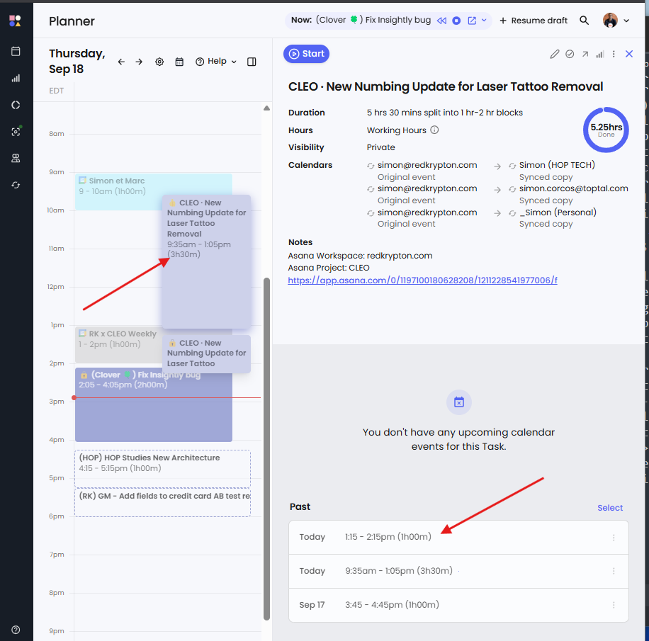

# Reclaim Planner Extension (Chrome Extension)

Adds helpful utilities on the Reclaim Planner page (`app.reclaim.ai/planner`) to speed up timesheets and task workflows.

Example:
- `1:15 - 2:15pm` → `1:15 - 2:15pm (1h00m)`

## Features

- ⏱️ Appends a duration to detected time ranges.
        
- 📋 Click the appended duration to copy the decimal value (e.g., `1.25`) to your clipboard for time entries.
- 🧲 Copy clean task titles: adds a copy button to the right of the task title in the details pane.
- 📅 Smart Google Meet links: for events with a Google Meet link, the extension appends `?authuser=<your-email>` 
        to the Join button URL. This ensures Google opens the meeting with the correct user account.
- ♻️ Updates automatically as the page content changes.
